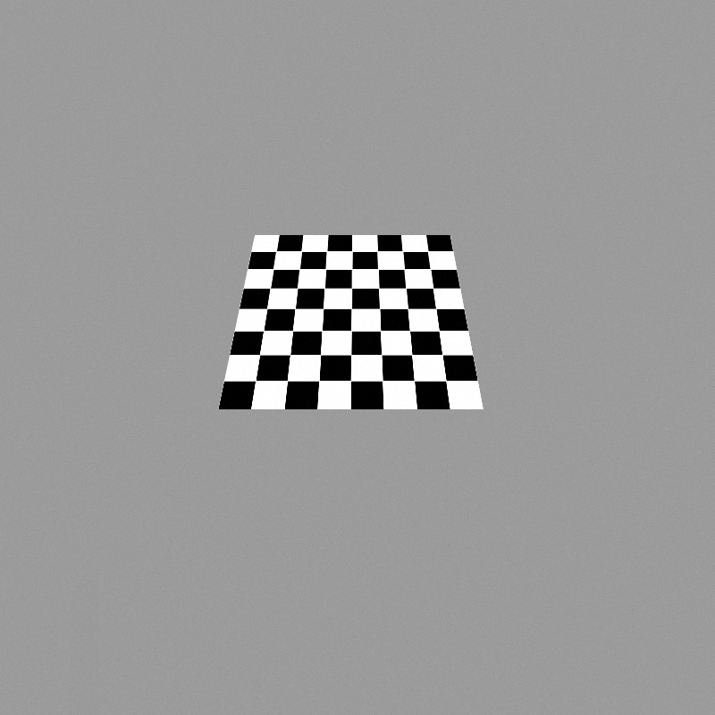
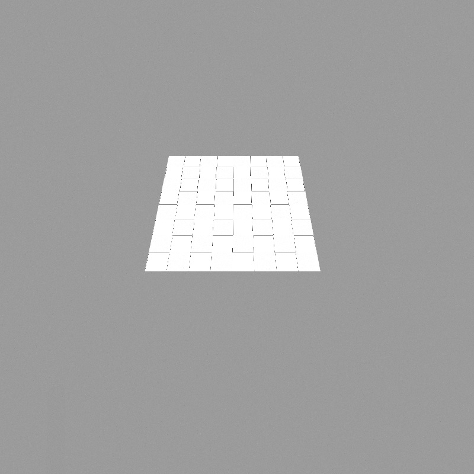
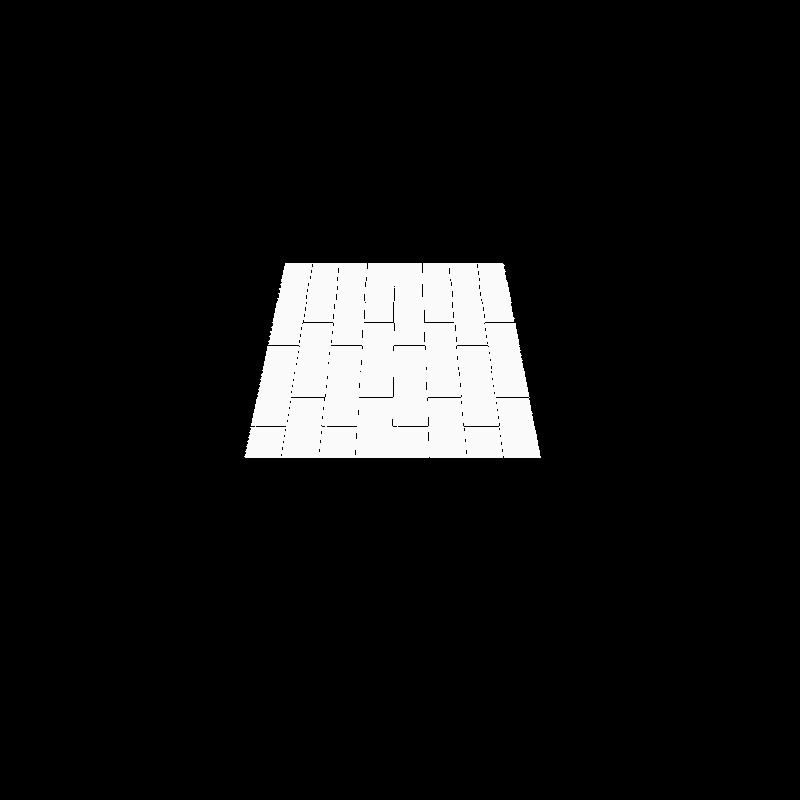
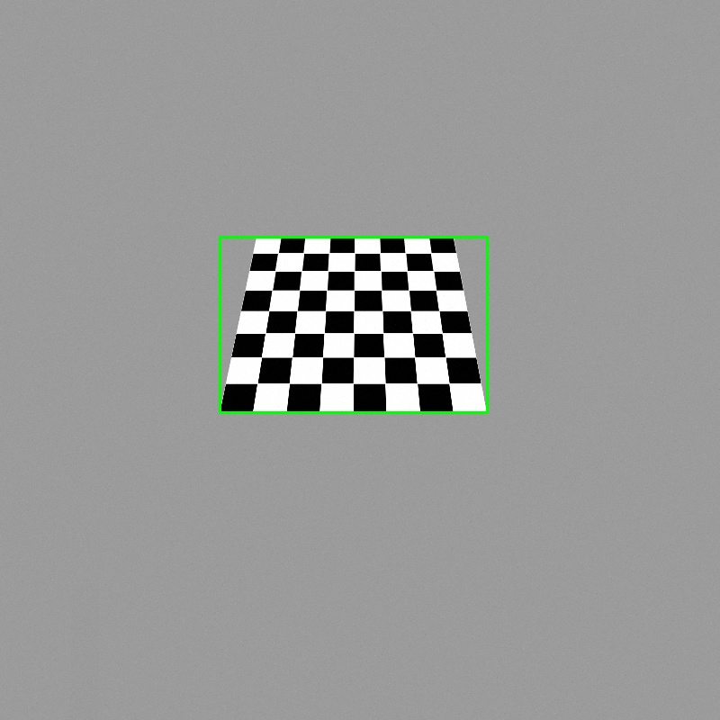
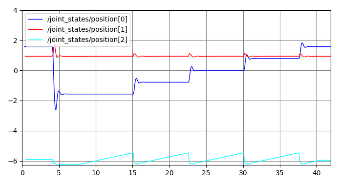
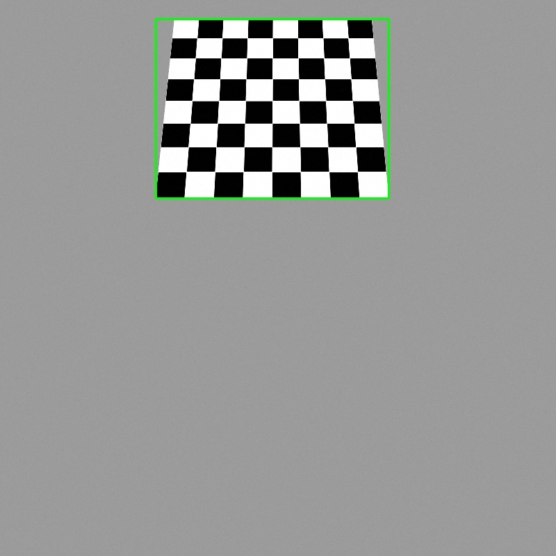

# ID6100: Robotics Laboratory

## Outline of Repository

```
.
├── src
    ├── rrbot_control
        ├── config      # declare and define all controllers
        ├── launch      # spawn all controllers
    ├── rrbot_description
        ├── meshes      
        ├── urdf        # definition files for the RR robot
    ├── rrbot_explore
        ├── launch      # launch gazebo world with robot
        ├── worlds      # gazebo world with selected object
        
```

## Add Object to the World
To add the object to the world, the following lines are added to the gazebo world in [gazebo_ros_demos/rrbot_gazebo/worlds](https://github.com/ros-simulation/gazebo_ros_demos/tree/kinetic-devel/rrbot_gazebo/worlds)
```xml
  <!-- Spawn chosen object in world -->
  <include>
      <uri>model://checkerboard_plane</uri>
      <name>checkerboard_plane</name>
      <pose>-0.25 4.0 0.1 0 0 0</pose>
  </include>
```
This was adapted from the example in the [Gazebo tutorial on model population](http://gazebosim.org/tutorials?tut=model_population&cat=build_world). The checkerboard plane is placed slightly above the ground

## Modifications to the Robot
The robot definition is created by modifying the package given in [gazebo_ros_demos/rrbot_description/urdf](https://github.com/ros-simulation/gazebo_ros_demos/tree/kinetic-devel/rrbot_description/urdf). More specifically:
1. In `rrbot.xacro`, to add a revolute joint to the base the following changes are made
```xml
<!-- <joint name="fixed" type="fixed">
    <parent link="world"/>
    <child link="link1"/>
  </joint> -->
  
  <joint name="joint0" type="continuous">
    <parent link="world"/>
    <child link="link1"/>
    <origin xyz="0 0 0" rpy="0 0 0"/>
    <axis xyz="0 0 1"/>
    <dynamics damping="0.7"/>
  </joint>
``` 
This removes the original fixed joint and adds a revolute joint with axis aligned along z-axis at the origin, which connects `link1` to the world.

2. To actuate the joint added previously, the following block of code is added in `rrbot.xacro`
```xml
<transmission name="tran0">
    <type>transmission_interface/SimpleTransmission</type>
    <joint name="joint0">
      <hardwareInterface>hardware_interface/EffortJointInterface</hardwareInterface>
    </joint>
    <actuator name="motor0">
      <hardwareInterface>hardware_interface/EffortJointInterface</hardwareInterface>
      <mechanicalReduction>1</mechanicalReduction>
    </actuator>
  </transmission>
```
The specification of the actuator for the joint is same as that of the other joints.

3. Similar changes have to be made in `robot.xml` to add the base joint
```xml
<!-- <joint name="fixed" type="fixed">
    <parent link="world"/>
    <child link="link1"/>
  </joint> -->
  <joint name="joint0" type="continous">
    <parent link="world"/>
    <child link="link1"/>
    <origin rpy="0 0 0" xyz="0 0.1 1.95"/>
    <axis xyz="0 0 1"/>
    <dynamics damping="0.7"/>
  </joint>
```

and to add the actuator for the new joint
```xml
<transmission name="tran0">
    <type>transmission_interface/SimpleTransmission</type>
    <joint name="joint0"/>
    <actuator name="motor0">
      <hardwareInterface>EffortJointInterface</hardwareInterface>
      <mechanicalReduction>1</mechanicalReduction>
    </actuator>
  </transmission>
```
## Adding Controller for New Joint
The configuration for the controllers is adapted from [gazebo_ros_demos/rrbot_control/config](https://github.com/ros-simulation/gazebo_ros_demos/tree/kinetic-devel/rrbot_control/config). The `rrbot_control.yaml` file specifies two "effort" controllers that take in a joint position (angle) as reference and output force/torque to the actuators. Because a new revolute joint and actuator is added to the robot, the following lines are added to this file to specify the new controller: 
```yaml
  joint0_position_controller:
    type: effort_controllers/JointPositionController
    joint: joint0
    pid: {p: 100.0, i: 0.01, d: 10.0}
```
Note that the `joint` name should match the one specified in the modified robot. The `type` of controller used is the same one for the other joints, along with same PID gains.

To launch this new controller, the following changes are made to the `rrbot_control.launch` file
```xml
  <!-- <node name="controller_spawner" pkg="controller_manager" type="spawner" respawn="false"
	output="screen" ns="/rrbot" args="joint_state_controller
					  joint1_position_controller
					  joint2_position_controller"/> -->

  <node name="controller_spawner" pkg="controller_manager" type="spawner" respawn="false"
	  output="screen" ns="/rrbot" args="joint_state_controller
              joint0_position_controller
              joint1_position_controller
              joint2_position_controller"/>
```
## Object Detection


A very rudimentary form of object detection is carried out to identify when the object comes into view. A sample image of the object in complete view is used as reference to illustrate the image processing used in `image_processing.py`:
1. First all black checkerboard squares are converted to white:
```python
  THRESH = 40
	idx = np.where((image <= [THRESH, THRESH, THRESH]).all(axis=2))
	thresh_image = deepcopy(image)
	thresh_image[idx] = [255, 255, 255]
```


2. The background is made to black using thresholding
```python
# threshold image to make bgd black
	ret, thresh = cv2.threshold(thresh_image, 200, 250, type=cv2.THRESH_BINARY)
	thresh_image = cv2.cvtColor(thresh, cv2.COLOR_BGR2GRAY)
```


3. Contours are identified and the one with largest area, if any, is retained. Using this largest contour, a bounding box is plotted
```python
  cont, _ = cv2.findContours(thresh_image, cv2.RETR_TREE, cv2.CHAIN_APPROX_SIMPLE)
  areas = [cv2.contourArea(c) for c in cont]

  if len(areas) > 0:
    max_area, max_cont = max(areas), cont[np.argmax(areas)]
    # create bounding box for largest contour
    x, y, w, h = cv2.boundingRect(max_cont)
    image = cv2.rectangle(image, (x,y), (x+w,y+h), (0,255,0), 2)
  else:
    max_area, max_cont = 0, 0
```


If the area of the identified contour exceeds a certain threshold value, then the object is in full view and we classify that as a succesful identification.

## Exploration Code
The code that carries out exploration and image processing is in `explore.py`. For each joint, publishers are created that send the position commands to corresponding controller topic
```python
  # n_joint = 3
  self.joint_names = [f"joint{x}" for x in range(n_joints)]
  self.pubs = {x: rospy.Publisher(
          f"/rrbot/{x}_position_controller/command", 
          Float64, 
          queue_size=10) for x in self.joint_names}
```

A subscriber is created to read the raw images in from the camera
```python
  self.sub = rospy.Subscriber("/rrbot/camera1/image_raw", Image, self.process_raw_image)
```

To visualize the state of the image processing, a publisher is created that sends the image to *"/rrbot/bbox_image"*
```python
  self.mask_pub = rospy.Publisher("/rrbot/bbox_image", Image, queue_size=10)
```

The raw image is formatted before it is passed on to the image processing code using `cv_bridge`
```python
  def process_raw_image(self, raw_image: Image):
    image = self.bridge.imgmsg_to_cv2(raw_image, desired_encoding="passthrough")
    area, _, masked_image = image_processing(image)

    if area > 0:
      self.mask_pub.publish(self.bridge.cv2_to_imgmsg(masked_image, encoding="bgr8"))
    else:
      self.mask_pub.publish(self.bridge.cv2_to_imgmsg(image, encoding="bgr8"))
    if area > self.detect_thresh:
      self.detected = True
```

### Exploration
Two kinds of control were implemented. The first was to hold the robot at specified joint angles. This is carried out in `Explore.hold_at_angle()`
```python
  def hold_at_angle(self, joint_angles=[math.pi / 2, math.pi / 4, 0]):
    curr_ang = {name: x for name, x in zip(self.joint_names, joint_angles)}
    while not rospy.is_shutdown():
      for name, pub in self.pubs.items():
        pub.publish(curr_ang[name])

      self.rate.sleep()
```

In the second, the strategy followed to explore and find the object is:
- Rotate base joint from 0 -> 2*pi
- Fix joint1's angle at pi/4
- For every base joint, rotate joint2 from -pi/4 -> pi/4
			
The assumption is made that the object is on the ground. If this assumption holds, then we should be able to find the object with this strategy. Once the object is found, the robot is held at the last commanded position.

```python
  def exploratory(self):
    curr_ang = {name: 0 for name in self.joint_names}
    curr_ang["joint1"] = math.pi / 4
    while not rospy.is_shutdown() and not self.detected:
      # rotate base joint for 2*pi radians
      curr_ang["joint0"] %= 2 * math.pi	
      self.pubs["joint0"].publish(curr_ang["joint0"])

      # fix first joint at specified angle
      self.pubs["joint1"].publish(curr_ang["joint1"])

      # rotate first joint between 0 and pi / 2
      curr_ang["joint2"] = 0
      while curr_ang["joint2"] <= math.pi / 4 and not self.detected:
        self.pubs["joint2"].publish(curr_ang["joint2"])
        curr_ang["joint2"] += self.rps
        self.rate.sleep()
      
      if not self.detected:
        curr_ang["joint0"] += (math.pi / 4)
      self.rate.sleep()

    if self.detected:
      hold_angles = [x for _, x in curr_ang.items()]
      rospy.loginfo(f"Object detected! Holding at: {[round(x * 180 / math.pi, 2) for x in hold_angles]}")
      self.hold_at_angle(hold_angles)
```
## Procedure
The following steps were followed to create the working repository
1. Create *catkin* workspace:
```bash
  mkdir -p ~/roslab/src
  cd roslab/
```

2. Clone `gazebo_ros_demos/` in parent directory
```bash
  cd ~/ && git clone https://github.com/ros-simulation/gazebo_ros_demos.git
```

3. Create `rrbot_description/` package:
```bash
  cd ~/roslab/src
  catkin_create_pkg rrbot_description 

  # copy default data from gazebo_ros_demos
  cp -r ~/gazebo_ros_demos/rrbot_description/meshes rrbot_description/
  cp -r ~/gazebo_ros_demos/rrbot_description/urdf rrbot_description/
```

4. Modify the `rrbot.xacro` and `rrbot.xml` files as mentioned previously.

5. Create `rrbot_control/` package:
```bash
  cd ~/roslab/src
  catkin_create_pkg rrbot_control catkin joint_state_publisher robot_state_publisher effort_controllers
  cd rrbot_control
  mkdir config
  mkdir launch

  # copy default config and launch file from gazebo_ros_demos
  cp -r ~/gazebo_ros_demos/rrbot_control/config/rrbot_control.yaml config/
  cp -r ~/gazebo_ros_demos/rrbot_control/launch/rrbot_control.launch launch/
```
Make changes to `rrbot_control.yaml` and `rrbot_control.launch` as specified previously

6. Create `rrbot_explore`/ package:
```bash
  cd ~/roslab/src
  catkin_create_pkg rrbot_explore catkin gazebo_ros gazebo_ros_control rrbot_control rrbot_description xacro
  cd rrbot_explore
  mkdir worlds
  mkdir launch

  # copy default world file and launch file from gazebo_ros_demos
  cp -r ~/gazebo_ros_demos/rrbot_gazebo/launch/rrbot_world.launch launch/
  cp -r ~/gazebo_ros_demos/rrbot_gazebo/worlds/rrbot.world worlds/
```
Make changes to `rrbot.world` as specified previously. Note that in `rrbot_world.launch`, line 12 needs to be changed
```xml
  <!-- <arg name="world_name" value="$(find rrbot_gazebo)/worlds/rrbot.world"/>  -->
  <arg name="world_name" value="$(find rrbot_explore)/worlds/rrbot.world"/>
```

7. Finally run `catkin_make`:
```bash
  cd ~/roslab
  catkin_make
```

## Running the Experiment
First get Gazebo up and running with
```bash
  roslaunch rrbot_explore rrbot_world.launch
```

Next, in a new terminal, launch the joint position controllers
```bash
  roslaunch rrbot_control rrbot_control.launch
```

Run the main exploration file in a new terminal
```bash
  python explore.py
```

(Optional) In a new terminal, use `image_view` to see the camera view (and the bounding box over the identified checkerboard) in realtime
```bash
  rosrun image_view image_view image:=/rrbot/bbox_image
```

## Results
The following plot shows the trajectories of the three joints as the robot explores to find the checkerboard_plane



Joint 1 is kept constant, while joint 0 rotates in steps of pi/4 and joint 2 rotates continuosly to get an appropriate sweep.

The final view from the camera (with the bounding box overlayed) when the robot classifies the object as "identified" is shown below



To generate the joint states plot, first run `rosrun joint_state_publisher joint_state_publisher _source_list:="['/rrbot/joint_states']` that will publish all joint states to `/joint_states`. Then open rqt plot with `rqt_plot` and add the following topics to the plotting:
- /joint_states/position[0]
- /joint_states/position[1]
- /joint_states/position[2]